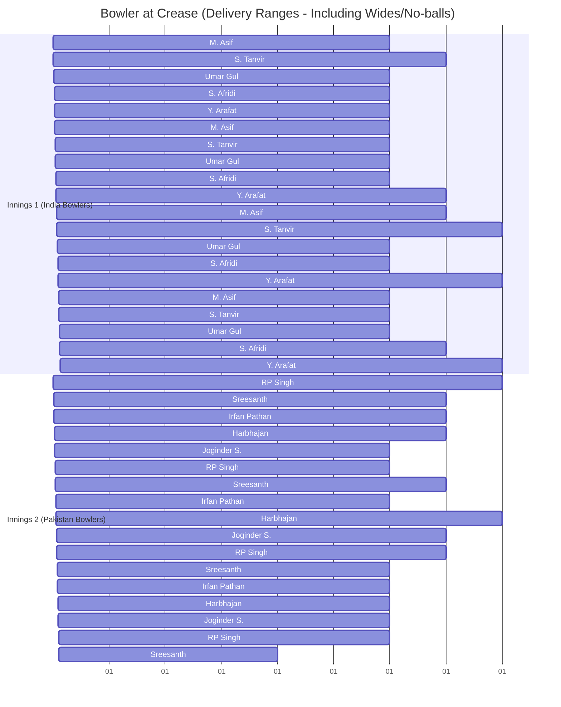

```mermaid
gantt
    title Bowler at Crease (Delivery Ranges - Including Wides/No-balls)
    dateFormat X
    axisFormat %d

    section Innings 1 (India Bowlers)
    M. Asif : 1, 6
    S. Tanvir : 7, 7
    Umar Gul : 14, 6
    S. Afridi : 20, 6
    Y. Arafat : 26, 6
    M. Asif : 32, 6
    S. Tanvir : 38, 6
    Umar Gul : 44, 6
    S. Afridi : 50, 6
    Y. Arafat : 56, 7
    M. Asif : 63, 7
    S. Tanvir : 70, 8
    Umar Gul : 78, 6
    S. Afridi : 84, 6
    Y. Arafat : 90, 8
    M. Asif : 98, 6
    S. Tanvir : 104, 6
    Umar Gul : 110, 6
    S. Afridi : 116, 7
    Y. Arafat : 123, 8
    
    section Innings 2 (Pakistan Bowlers)
    RP Singh : 1, 8
    Sreesanth : 9, 7
    Irfan Pathan : 16, 7
    Harbhajan : 23, 7
    Joginder S. : 30, 6
    RP Singh : 36, 6
    Sreesanth : 42, 7
    Irfan Pathan : 49, 6
    Harbhajan : 55, 8
    Joginder S. : 63, 7
    RP Singh : 70, 7
    Sreesanth : 77, 6
    Irfan Pathan : 83, 6
    Harbhajan : 89, 6
    Joginder S. : 95, 6
    RP Singh : 101, 6
    Sreesanth : 107, 4
```
