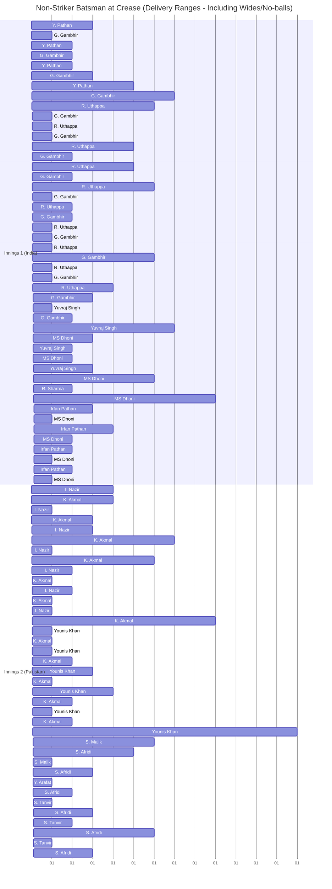

```mermaid
gantt
    title Non-Striker Batsman at Crease (Delivery Ranges - Including Wides/No-balls)
    dateFormat X
    axisFormat %d

    section Innings 1 (India)
    Y. Pathan : 1, 3
    G. Gambhir : 4, 1
    Y. Pathan : 5, 2
    G. Gambhir : 7, 2
    Y. Pathan : 9, 2
    G. Gambhir : 11, 3
    Y. Pathan : 14, 5
    G. Gambhir : 19, 7
    R. Uthappa : 26, 6
    G. Gambhir : 32, 1
    R. Uthappa : 33, 1
    G. Gambhir : 34, 1
    R. Uthappa : 35, 5
    G. Gambhir : 40, 2
    R. Uthappa : 42, 5
    G. Gambhir : 47, 2
    R. Uthappa : 49, 6
    G. Gambhir : 55, 1
    R. Uthappa : 56, 2
    G. Gambhir : 58, 2
    R. Uthappa : 60, 1
    G. Gambhir : 61, 1
    R. Uthappa : 62, 1
    G. Gambhir : 63, 6
    R. Uthappa : 69, 1
    G. Gambhir : 70, 1
    R. Uthappa : 71, 4
    G. Gambhir : 75, 3
    Yuvraj Singh : 78, 1
    G. Gambhir : 79, 2
    Yuvraj Singh : 81, 7
    MS Dhoni : 88, 3
    Yuvraj Singh : 91, 2
    MS Dhoni : 93, 2
    Yuvraj Singh : 95, 3
    MS Dhoni : 98, 6
    R. Sharma : 104, 2
    MS Dhoni : 106, 9
    Irfan Pathan : 115, 3
    MS Dhoni : 118, 1
    Irfan Pathan : 119, 4
    MS Dhoni : 123, 2
    Irfan Pathan : 125, 2
    MS Dhoni : 127, 1
    Irfan Pathan : 128, 2
    MS Dhoni : 130, 1

    section Innings 2 (Pakistan)
    I. Nazir : 1, 4
    K. Akmal : 5, 4
    I. Nazir : 9, 1
    K. Akmal : 10, 3
    I. Nazir : 13, 3
    K. Akmal : 16, 7
    I. Nazir : 23, 1
    K. Akmal : 24, 6
    I. Nazir : 30, 2
    K. Akmal : 32, 1
    I. Nazir : 33, 2
    K. Akmal : 35, 1
    I. Nazir : 36, 1
    K. Akmal : 37, 9
    Younis Khan : 46, 1
    K. Akmal : 47, 1
    Younis Khan : 48, 1
    K. Akmal : 49, 2
    Younis Khan : 51, 3
    K. Akmal : 54, 1
    Younis Khan : 55, 4
    K. Akmal : 59, 2
    Younis Khan : 61, 1
    K. Akmal : 62, 2
    Younis Khan : 64, 13
    S. Malik : 77, 6
    S. Afridi : 83, 5
    S. Malik : 88, 1
    S. Afridi : 89, 3
    Y. Arafat : 92, 1
    S. Afridi : 93, 2
    S. Tanvir : 95, 1
    S. Afridi : 96, 3
    S. Tanvir : 99, 2
    S. Afridi : 101, 6
    S. Tanvir : 107, 1
    S. Afridi : 108, 3
```
