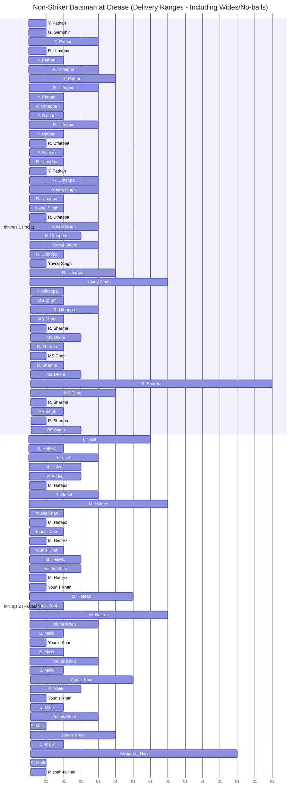

```mermaid
gantt
    title Non-Striker Batsman at Crease (Delivery Ranges - Including Wides/No-balls)
    dateFormat X
    axisFormat %d

    section Innings 1 (India)
    Y. Pathan : 1, 1
    G. Gambhir : 2, 1
    Y. Pathan : 3, 4
    R. Uthappa : 7, 1
    Y. Pathan : 8, 2
    R. Uthappa : 10, 4
    Y. Pathan : 14, 5
    R. Uthappa : 19, 4
    Y. Pathan : 23, 2
    R. Uthappa : 25, 2
    Y. Pathan : 27, 2
    R. Uthappa : 29, 4
    Y. Pathan : 33, 2
    R. Uthappa : 35, 1
    Y. Pathan : 36, 2
    R. Uthappa : 38, 2
    Y. Pathan : 40, 1
    R. Uthappa : 41, 4
    Yuvraj Singh : 45, 4
    R. Uthappa : 49, 2
    Yuvraj Singh : 51, 2
    R. Uthappa : 53, 1
    Yuvraj Singh : 54, 4
    R. Uthappa : 58, 3
    Yuvraj Singh : 61, 4
    R. Uthappa : 65, 2
    Yuvraj Singh : 67, 1
    R. Uthappa : 68, 5
    Yuvraj Singh : 73, 8
    R. Uthappa : 81, 2
    MS Dhoni : 83, 2
    R. Uthappa : 85, 4
    MS Dhoni : 89, 2
    R. Sharma : 91, 1
    MS Dhoni : 92, 3
    R. Sharma : 95, 2
    MS Dhoni : 97, 1
    R. Sharma : 98, 2
    MS Dhoni : 100, 3
    R. Sharma : 103, 14
    MS Dhoni : 117, 5
    R. Sharma : 122, 1
    RP Singh : 123, 2
    R. Sharma : 125, 1
    RP Singh : 126, 3
    section Innings 2 (Pakistan)
    I. Nazir : 1, 7
    M. Hafeez : 8, 2
    I. Nazir : 10, 4
    M. Hafeez : 14, 3
    K. Akmal : 17, 3
    M. Hafeez : 20, 1
    K. Akmal : 21, 4
    M. Hafeez : 25, 8
    Younis Khan : 33, 2
    M. Hafeez : 35, 1
    Younis Khan : 36, 2
    M. Hafeez : 38, 1
    Younis Khan : 39, 2
    M. Hafeez : 41, 3
    Younis Khan : 44, 3
    M. Hafeez : 47, 1
    Younis Khan : 48, 1
    M. Hafeez : 49, 6
    Younis Khan : 55, 2
    M. Hafeez : 57, 8
    Younis Khan : 65, 4
    S. Malik : 69, 2
    Younis Khan : 71, 1
    S. Malik : 72, 2
    Younis Khan : 74, 4
    S. Malik : 78, 2
    Younis Khan : 80, 6
    S. Malik : 86, 3
    Younis Khan : 89, 1
    S. Malik : 90, 2
    Younis Khan : 92, 4
    S. Malik : 96, 1
    Younis Khan : 97, 5
    S. Malik : 102, 2
    Misbah-ul-Haq : 104, 12
    S. Malik : 116, 1
    Misbah-ul-Haq : 117, 1
```
