# 🏏 Non-Striker Batsman Timeline - 2007 T20 World Cup Final

**India vs Pakistan**

---

## 📊 Chart Overview

This Gantt chart visualizes which batsman was positioned at the **non-striker's end** (awaiting their turn) during each delivery of the match.

- **X-axis**: Delivery number (1-120 legal balls per innings, plus wides/no-balls)
- **Y-axis**: Player names organized by innings
- **Bar length**: Duration at non-striker position (in deliveries)
- **Sections**: Innings 1 (India batting) and Innings 2 (Pakistan batting)

---

## 📈 Timeline Visualization

```mermaid
gantt
    title Non-Striker Batsman at Crease (Delivery Ranges - Including Wides/No-balls)
    dateFormat X
    axisFormat %d

    section Innings 1 (India)
    Y. Pathan : 1, 2
    G. Gambhir : 2, 3
    Y. Pathan : 3, 7
    R. Uthappa : 7, 8
    Y. Pathan : 8, 10
    R. Uthappa : 10, 14
    Y. Pathan : 14, 19
    R. Uthappa : 19, 23
    Y. Pathan : 23, 25
    R. Uthappa : 25, 27
    Y. Pathan : 27, 29
    R. Uthappa : 29, 33
    Y. Pathan : 33, 35
    R. Uthappa : 35, 36
    Y. Pathan : 36, 38
    R. Uthappa : 38, 40
    Y. Pathan : 40, 41
    R. Uthappa : 41, 45
    Yuvraj Singh : 45, 49
    R. Uthappa : 49, 2
    Yuvraj Singh : 51, 2
    R. Uthappa : 53, 1
    Yuvraj Singh : 54, 4
    R. Uthappa : 58, 3
    Yuvraj Singh : 61, 4
    R. Uthappa : 65, 2
    Yuvraj Singh : 67, 1
    R. Uthappa : 68, 5
    Yuvraj Singh : 73, 8
    R. Uthappa : 81, 2
    MS Dhoni : 83, 2
    R. Uthappa : 85, 4
    MS Dhoni : 89, 2
    R. Sharma : 91, 1
    MS Dhoni : 92, 3
    R. Sharma : 95, 2
    MS Dhoni : 97, 1
    R. Sharma : 98, 2
    MS Dhoni : 100, 3
    R. Sharma : 103, 14
    MS Dhoni : 117, 5
    R. Sharma : 122, 1
    RP Singh : 123, 2
    R. Sharma : 125, 1
    RP Singh : 126, 3
    
    section Innings 2 (Pakistan)
    I. Nazir : 1, 7
    M. Hafeez : 8, 2
    I. Nazir : 10, 4
    M. Hafeez : 14, 3
    K. Akmal : 17, 3
    M. Hafeez : 20, 1
    K. Akmal : 21, 4
    M. Hafeez : 25, 8
    Younis Khan : 33, 2
    M. Hafeez : 35, 1
    Younis Khan : 36, 2
    M. Hafeez : 38, 1
    Younis Khan : 39, 2
    M. Hafeez : 41, 3
    Younis Khan : 44, 3
    M. Hafeez : 47, 1
    Younis Khan : 48, 1
    M. Hafeez : 49, 6
    Younis Khan : 55, 2
    M. Hafeez : 57, 8
    Younis Khan : 65, 4
    S. Malik : 69, 2
    Younis Khan : 71, 1
    S. Malik : 72, 2
    Younis Khan : 74, 4
    S. Malik : 78, 2
    Younis Khan : 80, 6
    S. Malik : 86, 3
    Younis Khan : 89, 1
    S. Malik : 90, 2
    Younis Khan : 92, 4
    S. Malik : 96, 1
    Younis Khan : 97, 5
    S. Malik : 102, 2
    Misbah-ul-Haq : 104, 12
    S. Malik : 116, 1
    Misbah-ul-Haq : 117, 1
```

---

## 🎯 How to Read This Chart

| Element | Meaning |
|---------|---------|
| **Horizontal bar** | Time span player is at non-striker end |
| **Bar length** | Number of deliveries faced from non-striker position |
| **New row entry** | Batsman rotates to/from striker position |
| **Section break** | Innings transition (different batting team) |

---

## 📊 Match Statistics

### Innings 1 (India Batting)
- **Opening pair**: G. Gambhir & Y. Pathan
- **Batting sequence**: 8 players took strike
- **Total deliveries faced**: 129 (120 legal + 9 extras)

### Innings 2 (Pakistan Batting)
- **Opening pair**: M. Hafeez & I. Nazir
- **Batting sequence**: 7 players took strike
- **Total deliveries faced**: Variable based on match situation

---

## 💡 Key Observations

- **Partnership duration**: Longer bars indicate stable partnerships
- **Frequent rotations**: Indicates quick singles and aggressive batting
- **Batsman availability**: Shows who faced most deliveries from standing position
- **Strategic changes**: Visible breaks indicate mid-innings disruptions (wickets, injuries)

---

**Related Charts:**
- [Striker Timeline](striker_gantt.md) - Deliveries at striker end (facing bowler)
- [Bowler Rotation](bowler_gantt.md) - Bowling sequence and overs allocation
