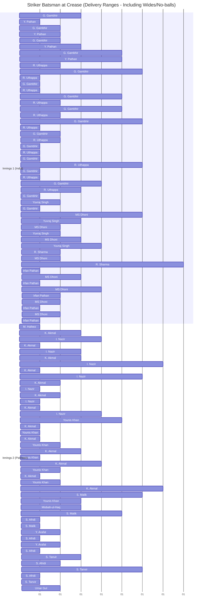

```mermaid
gantt
    title Striker Batsman at Crease (Delivery Ranges - Including Wides/No-balls)
    dateFormat X
    axisFormat %d

    section Innings 1 (India)
    G. Gambhir : 1, 3
    Y. Pathan : 4, 1
    G. Gambhir : 5, 2
    Y. Pathan : 7, 2
    G. Gambhir : 9, 2
    Y. Pathan : 11, 3
    G. Gambhir : 14, 5
    Y. Pathan : 19, 5
    R. Uthappa : 24, 2
    G. Gambhir : 26, 6
    R. Uthappa : 32, 1
    G. Gambhir : 33, 1
    R. Uthappa : 34, 1
    G. Gambhir : 35, 5
    R. Uthappa : 40, 2
    G. Gambhir : 42, 5
    R. Uthappa : 47, 2
    G. Gambhir : 49, 6
    R. Uthappa : 55, 1
    G. Gambhir : 56, 2
    R. Uthappa : 58, 2
    G. Gambhir : 60, 1
    R. Uthappa : 61, 1
    G. Gambhir : 62, 1
    R. Uthappa : 63, 6
    G. Gambhir : 69, 1
    R. Uthappa : 70, 1
    G. Gambhir : 71, 4
    R. Uthappa : 75, 3
    G. Gambhir : 78, 1
    Yuvraj Singh : 79, 2
    G. Gambhir : 81, 1
    MS Dhoni : 82, 6
    Yuvraj Singh : 88, 3
    MS Dhoni : 91, 2
    Yuvraj Singh : 93, 2
    MS Dhoni : 95, 3
    Yuvraj Singh : 98, 4
    R. Sharma : 102, 2
    MS Dhoni : 104, 2
    R. Sharma : 106, 8
    Irfan Pathan : 114, 1
    MS Dhoni : 115, 3
    Irfan Pathan : 118, 1
    MS Dhoni : 119, 4
    Irfan Pathan : 123, 2
    MS Dhoni : 125, 2
    Irfan Pathan : 127, 1
    MS Dhoni : 128, 2
    Irfan Pathan : 130, 1

    section Innings 2 (Pakistan)
    M. Hafeez : 1, 1
    K. Akmal : 2, 3
    I. Nazir : 5, 4
    K. Akmal : 9, 1
    I. Nazir : 10, 3
    K. Akmal : 13, 3
    I. Nazir : 16, 7
    K. Akmal : 23, 1
    I. Nazir : 24, 6
    K. Akmal : 30, 2
    I. Nazir : 32, 1
    K. Akmal : 33, 2
    I. Nazir : 35, 1
    K. Akmal : 36, 1
    I. Nazir : 37, 4
    Younis Khan : 41, 5
    K. Akmal : 46, 1
    Younis Khan : 47, 1
    K. Akmal : 48, 1
    Younis Khan : 49, 2
    K. Akmal : 51, 3
    Younis Khan : 54, 1
    K. Akmal : 55, 4
    Younis Khan : 59, 2
    K. Akmal : 61, 1
    Younis Khan : 62, 2
    K. Akmal : 64, 7
    S. Malik : 71, 6
    Younis Khan : 77, 3
    Misbah-ul-Haq : 80, 3
    S. Malik : 83, 5
    S. Afridi : 88, 1
    S. Malik : 89, 1
    Y. Arafat : 90, 2
    S. Afridi : 92, 1
    Y. Arafat : 93, 2
    S. Afridi : 95, 1
    S. Tanvir : 96, 3
    S. Afridi : 99, 2
    S. Tanvir : 101, 6
    S. Afridi : 107, 1
    S. Tanvir : 108, 1
    Umar Gul : 109, 2
```
